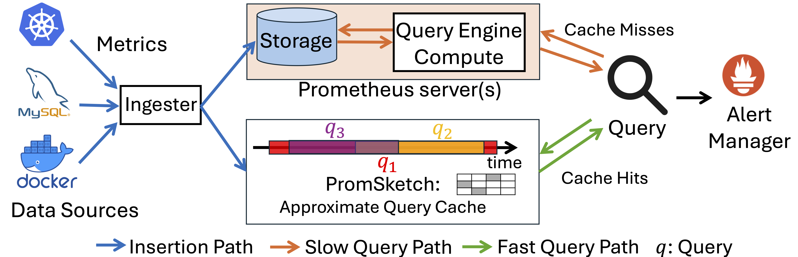
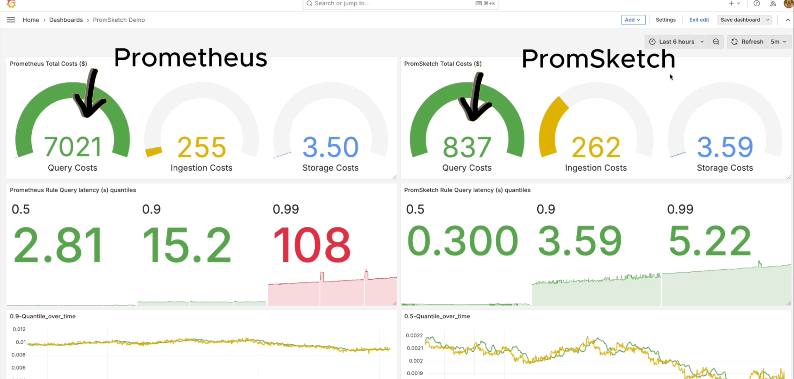

<h1 align="center">PromSketch: Approximation-First Timeseries Qery At Scale</h1>


## About

PromSketch is an approximation-first timeseries query framework serving as intermediate result caches for cloud telemetry systems. It eliminates two major query bottlnecks in window-based aggregation queries, i.e., 1) repeated data scans, and 2) repeated query computation concerning window overlaps in rule queries. 

<p align="center">  </p>

PromSketch combines approximate window-based query frameworks, e.g., Exponential Historgrams, and sketch-based precomputation as algorithmic building blocks. It can serve as a plugin to Prometheus and VictoriaMetrics, two representative cloud monitoring systems, and significantly reduces query latency operational dollar costs.

Check out our PromSketch [demo](https://youtu.be/skoXfeZZj4I) and [paper](https://www.vldb.org/pvldb/vol18/p2348-zhu.pdf) here!



## Quick Start
### Install Dependencies
```
# installs Golang
wget https://go.dev/dl/go1.22.4.linux-amd64.tar.gz
sudo rm -rf /usr/local/go && sudo tar -C /usr/local -xzf go1.22.4.linux-amd64.tar.gz
export PATH=$PATH:/usr/local/go/bin
```

```
# installs nvm (Node Version Manager)
curl -o- https://raw.githubusercontent.com/nvm-sh/nvm/v0.40.0/install.sh | bash
# download and install Node.js (you may need to restart the terminal)
nvm install 20
```

### Datasets
* Goolge Cluster Data v1: https://github.com/google/cluster-data/blob/master/TraceVersion1.md
* Power dataset: https://www.kaggle.com/datasets/uciml/electric-power-consumption-data-set?resource=download
* CAIDA traces: https://www.caida.org/catalog/datasets/passive_dataset_download/

### Run EHUniv test
```
cd promsketch
go test -v -timeout 0 -run ^TestExpoHistogramUnivMonOptimizedCAIDA$ github.com/froot/promsketch
```

### Run EHKLL test
```
cd promsketch
go test -v -timeout 0 -run ^TestCostAnalysisQuantile$ github.com/froot/promsketch
```

### Integration with Prometheus

```
git clone git@github.com:zzylol/prometheus-sketches.git
```
Compile:
```
cd prometheus-sketches
make build
```

### Integration with VictoriaMetrics single-node version

```
git clone git@github.com:zzylol/VictoriaMetrics.git
```
Compile:
```
cd VictoriaMetrics
make victoria-metrics
make vmalert
```

### Integration with VictoriaMetrics Cluster version
https://github.com/zzylol/VictoriaMetrics-cluster

## Citation
Please consider citing this work if you find the repository helpful.
```
@article{zhu2025approximation,
  title={Approximation-First Timeseries Monitoring Query At Scale},
  author={Zhu, Zeying and Chamberlain, Jonathan and Wu, Kenny and Starobinski, David and Liu, Zaoxing},
  journal={arXiv preprint arXiv:2505.10560},
  year={2025}
}
```

## Contact
Feel free to raise issues or contact us if you have any questions or suggestions. You can reach us at:
* Zeying Zhu (zeyingz@umd.edu)
* Alan Zaoxing Liu (zaoxing@umd.edu)
